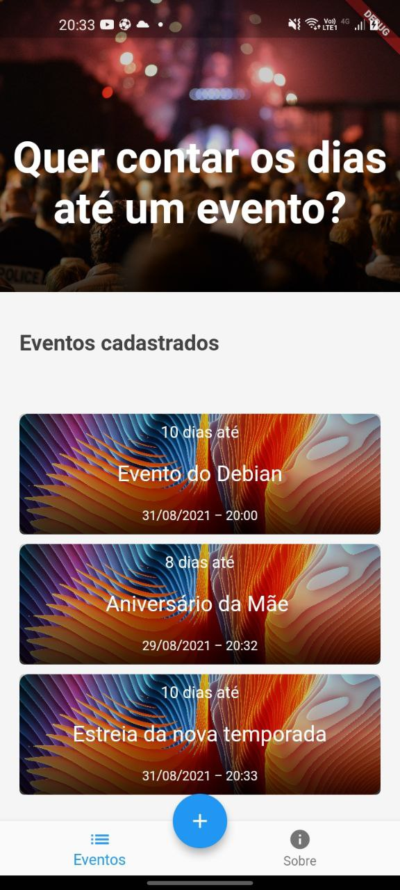
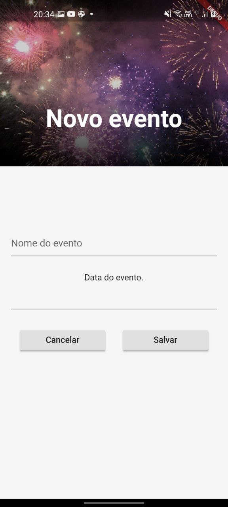
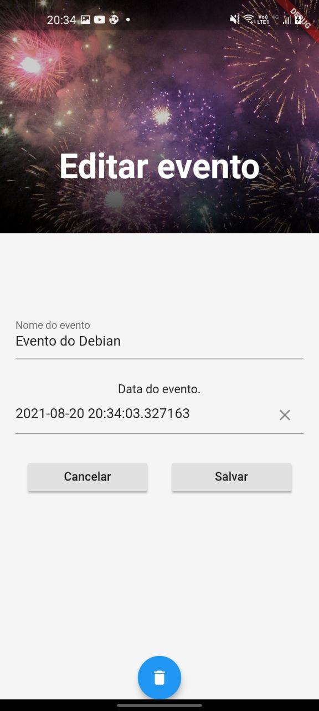
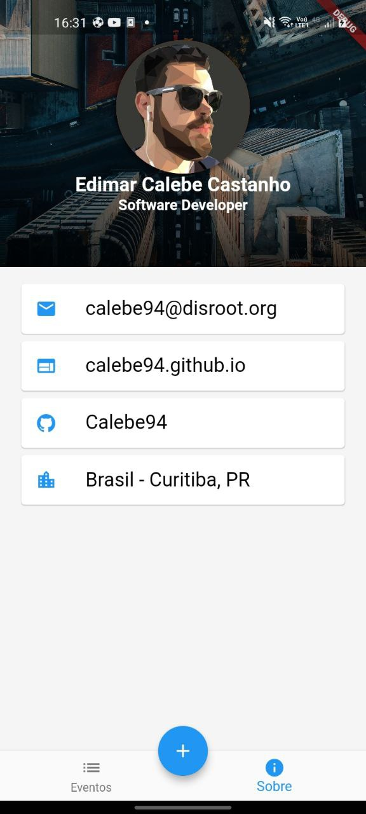

# Countdown Calendar

#### A countdown calendar app, with flutter.

See the days tick down to your vacation, weding, or birthday party.
Get notified every day how many days are left until the event. 
And keep track of the events you have.

## Usage

<br />  


<h3>Main screen</h3>
<p>In this screen you can check the events you have already registered.</p>
<br/><br/><br/><br/><br/><br/>


<h3>New event</h3>
<p>You can add new ones by clicking in the "+" button.</p>
<br/><br/><br/><br/><br/><br/>


<h3>Edit events</h3>
<p>You can also edit the existing events by clicking on the cards.</p>
<br/><br/><br/><br/><br/><br/>


<h3>About page</h3>
<p>Check the developer contatct info.</p>
<br/><br/><br/><br/><br/><br/>

<br/>

## Development Setup

Clone the repository and run the following commands:

```
flutter pub get
flutter run
```

## Inspiration

The design of this app was inspired by [Flutter-Travel-Application](https://github.com/afgprogrammer/Flutter-Travel-Application) from [afgprogrammer](https://github.com/afgprogrammer/Flutter-Travel-Application) and [gskinner vignettes](https://github.com/gskinnerTeam/flutter_vignettes);

## Developer

|  |
|:---------------------------------------------------------------------------------:|
| [Edimar Calebe Castanho (Calebe94)](https://github.com/Calebe94)                  |

# License

All software is covered under [MIT License](https://opensource.org/licenses/MIT).

Permission is hereby granted, free of charge, to any person obtaining a copy of this software and associated documentation files (the "Software"), to deal in the Software without restriction, including without limitation the rights to use, copy, modify, merge, publish, distribute, sublicense, and/or sell copies of the Software, and to permit persons to whom the Software is furnished to do so, subject to the following conditions:

The above copyright notice and this permission notice shall be included in all copies or substantial portions of the Software.

THE SOFTWARE IS PROVIDED "AS IS", WITHOUT WARRANTY OF ANY KIND, EXPRESS OR IMPLIED, INCLUDING BUT NOT LIMITED TO THE WARRANTIES OF MERCHANTABILITY, FITNESS FOR A PARTICULAR PURPOSE AND NONINFRINGEMENT. IN NO EVENT SHALL THE AUTHORS OR COPYRIGHT HOLDERS BE LIABLE FOR ANY CLAIM, DAMAGES OR OTHER LIABILITY, WHETHER IN AN ACTION OF CONTRACT, TORT OR OTHERWISE, ARISING FROM, OUT OF OR IN CONNECTION WITH THE SOFTWARE OR THE USE OR OTHER DEALINGS IN THE SOFTWARE.
